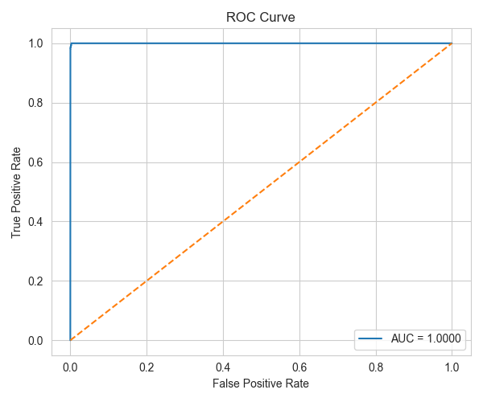
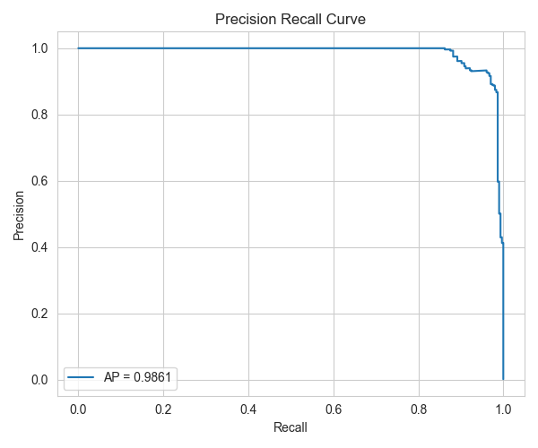
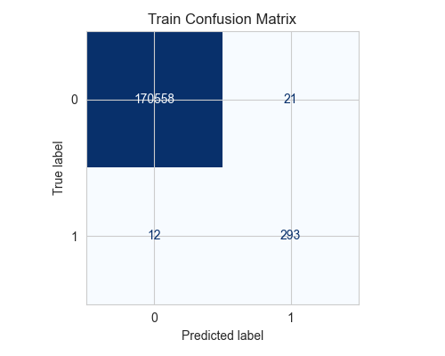
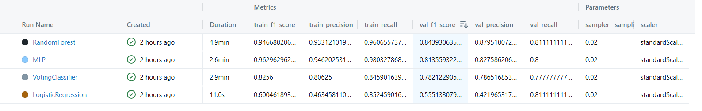

# Credit Card Fraud Detection (End-to-End ML + MLOps)

## Contents

* [Project Overview](#-project-overview)
* [Key Features](#-key-features)
* [Problem Statement](#-problem-statement)
* [Dataset Characteristics](#-dataset-characteristics)
* [Data Preprocessing](#️-data-preprocessing)
* [Modeling Approach](#-modeling-approach)
* [Model Evaluation](#-model-evaluation)
* [Evaluation Visualizations](#-evaluation-visualizations)
* [Experiment Tracking with MLflow](#-experiment-tracking-with-mlflow)
* [Project Structure](#-project-structure)
* [How to Run](#️-how-to-run)
* [Docker Support](#-docker-support)
* [API Usage](#-api-usage)
* [Results Summary](#-results-summary)

---

## Project Overview

This project focuses on building an **end-to-end machine learning system** for detecting fraudulent credit card transactions.
The solution addresses **severe class imbalance**, evaluates multiple classification models, tracks experiments using **MLflow**, and prepares the model for **production deployment** using **FastAPI** and **Docker**.

The pipeline is fully configurable via **command-line arguments**, ensuring reproducibility and scalability.

---

## Key Features

* End-to-end ML pipeline (data → training → evaluation → tracking)
* Handling **highly imbalanced data** using multiple sampling strategies
* Comparison of multiple ML models
* **Experiment tracking & artifact logging** with MLflow
* Production-ready structure (API + Docker support)
* Rich evaluation metrics & visualizations (ROC, PR, Confusion Matrix)

---

## Problem Statement

Credit card fraud detection is a **highly imbalanced binary classification problem**, where fraudulent transactions represent a very small fraction of total transactions.

Challenges include:

* Extreme class imbalance
* High cost of false negatives (missed fraud)
* Need for recall–precision trade-off optimization

---

## Dataset Characteristics

* Binary target variable: `fraud / non-fraud`
* Strong class imbalance
* Skewed numerical features such as `Amount` and `Time`

---

## Data Preprocessing

* Log transformation for skewed numerical features
* Feature scaling:

  * `StandardScaler`
  * `MinMaxScaler`
* Sampling strategies:

  * **OverSampling**
  * **UnderSampling**
  * **Hybrid (Over + Under)**

Sampling method and ratio are configurable via CLI.

---

## Modeling Approach

The following models are trained and evaluated:

| Model               | Description                     |
| ------------------- | ------------------------------- |
| Logistic Regression | Baseline linear classifier      |
| Random Forest       | Ensemble tree-based model       |
| MLP Classifier      | Neural network-based classifier |
| Voting Classifier   | Ensemble of multiple models     |

Each model is trained using **GridSearchCV** to optimize hyperparameters based on **F1-score**.

---

## Model Evaluation

Evaluation is performed on **train** and **validation** sets using:

* F1 Score
* Precision
* Recall
* ROC-AUC
* Precision-Recall AUC

### Visualizations Logged

* ROC Curve
* Precision-Recall Curve
* Confusion Matrix

All figures are automatically logged as **MLflow artifacts**.

---

## Evaluation Visualizations

### ROC Curve

The ROC curve visualizes the relationship between **True Positive Rate** and **False Positive Rate** across different classification thresholds.

* Useful for assessing overall model discrimination
* Area Under the Curve (AUC) summarizes performance



---

### Precision–Recall Curve

Due to the **severe class imbalance**, the Precision–Recall curve provides a more informative evaluation than ROC.

* Highlights the trade-off between precision and recall
* Average Precision (AP) reflects performance on the minority class



---

### Confusion Matrix

The confusion matrix shows the distribution of correct and incorrect predictions.

* Emphasizes **False Negatives**, which are costly in fraud detection
* Helps analyze model behavior at a given threshold



---

## Experiment Tracking with MLflow

MLflow is used to track:

* Hyperparameters (scaler, sampler, ratio, model params)
* Metrics (train & validation)
* Evaluation plots
* Trained models

### Example MLflow Runs



> This enables systematic comparison between models and configurations.

---

## Project Structure

```text
.
├── assets/             # plots
├── models/             # Trained models
├── notebooks/          # EDA notebooks
├── script/
│   └── main.py         # Training entry point
├── src/
│   ├── data/           # Data loading
│   ├── features/       # Preprocessing & sampling
│   ├── models/         # train.py, evaluate.py, model_registry.py
│   ├── visualization/  # ROC, PR, Confusion Matrix plots
│   └── serving/        # API code for model serving
├── .dockerignore
├── .gitignore
├── Dockerfile
├── requirements.txt
└── README.md

---

## ▶️ How to Run

### 1️⃣ Install Dependencies

```bash
pip install -r requirements.txt
```

### 2️⃣ Run Training Pipeline

```bash
python main.py \
  --train_path data_sets/train.csv \
  --val_path data_sets/val.csv \
  --scaler standardScaler \
  --sampler 1 \
  --ratio 0.02
```

### 3️⃣ Launch MLflow UI

```bash
mlflow ui
```
---

## Docker Support

```bash
docker build -t fraud-detection .
docker run -p 8000:8000 fraud-detection
```

---

## API Usage

### Endpoint

```http
POST /predict
```

### Request Example

```json
{
  "Time": 168239.0,
  "V1": -0.014376598797363,
  "V2": 0.984717410028929,
  "V3": -0.754095883713859,
  "V4": -0.104578899056373,
  "V5": 0.855295214796371,
  "V6": -0.900631470169026,
  "V7": 1.16906120616536,
  "V8": -0.12214994132379,
  "V9": -0.324581677187853,
  "V10": -1.63691535899986,
  "V11": 1.38135580391531,
  "V12": 0.475251454739172,
  "V13": -0.0767598130098594,
  "V14": -2.61993077833604,
  "V15": -1.53783787703286,
  "V16": 0.463898586597207,
  "V17": 1.73371224124777,
  "V18": 1.10918967465798,
  "V19": -0.2983600466239,
  "V20": 0.0227019492255383,
  "V21": 0.154205940138999,
  "V22": 0.611718070964102,
  "V23": -0.18690965890072,
  "V24": -0.121776781104716,
  "V25": -0.0701377100607078,
  "V26": 0.629360325317958,
  "V27": 0.0218504488090598,
  "V28": 0.0772814689972035,
  "Amount": 58.31
}
```

### Response Example

```json
{
  "fraud_probability": 0.022505198797034023,
  "fraud_prediction": 0
}
```

---

## Results Summary

| Model               | Train F1 | Val F1 |
| ------------------- | -------- | ------ |
| Logistic Regression | 0.60     | 0.55   |
| Random Forest       | 0.95     | 0.84   |
| MLP                 | 0.96     | 0.81   |
| Voting Classifier   | 0.83     | 0.78   |

**Random Forest** achieved the best balance between recall and precision on validation data.

---
قولي 👍
